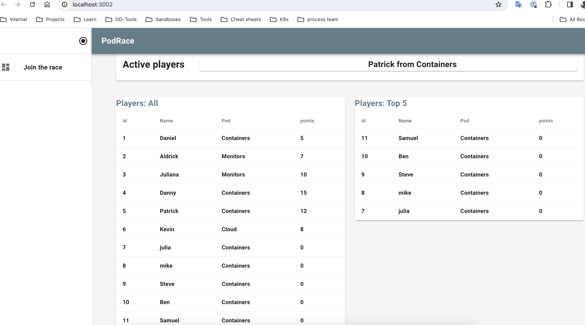

# pdrace for docker

## About pdRace



pdRace is a FullStack application created by some Datadog's TSEs to connect and test Datadog features in a real and fun environment.

The logic behind this is to create a weekly "Tse Pods Race" in which the Players (TSEs) will collect points to their Pods (Specs) with Events.

These Events are day to day actions with points associated to them, example:

- Receive a flare = 5 pts
- Finishing a call = 10 pts
- Collaborate = 10 pts
- Run a workshop = 50 pts
- Bring cookies to the team = 1 billions pts

### Services involved: 

- **pdclient** Frontend services which use nextjs (app router) [more info here:](client/README.md)
- **pdServer** Backend service build in Ruby on Rails that serves as API for the frontend to provide the info from the Users, Pods, and Events  [more info here:](server/README.md)
- **pdPostgres** Postgres Database that stores pdServer model data
- **pdZendesk** Message broker service build in go that mimics zendesk's behavior by using RabbitMQ as Queue to provide random Events associated to Random Users. [more info here:](zendesk/README.md)

### Building the services images: 

---

Architecture considerations :warning:

If you are building this image in your local machine with a mac processor (ARM) but are *planning to use the image in a linux AMD* (most common in different cloud providers) you will need to include the [processor flag](https://docs.docker.com/build/building/multi-platform/#:~:text=When%20triggering%20a%20build%2C%20use,one%20platform%20at%20a%20time) **--platform=linux/amd64** to make it compatible with those processors

Otherwise if you are plannig to run these images locally with docker in local host you can skip this flag. 

---

The command to build a docker image is: 

```
docker build --platform=linux/amd64 -t <hub-user>/<repo-name>:<image_tag> .
```

However, to explain this process in more detail let's follow an use case.  

The steps below will create a docker image for the client service build with next.js: 

#### Build image check list: 
- The main service directory contains a **dockerfile (./client/dockerfile)**
- Docker is up and running in your computer (if you are using docker-desktop be sure it's running)
- You are logged to your docker user as docker build use it to store the image in docker hub (optional)
 
1. Access the client service directory  
```
cd client
``` 

2. The command below will use the **dockerfile** available in the directory to build the image. 
```
docker build --platform=linux/amd64 -t ccdaniele/pdrace-client:docker-v1-amd64.
```

Before continuing let's take a look at what is happening here: 

- **docker build** ask docker to build the image

- **--platform=linux/amd64** set the image to be build for linuxamd architecture processors (most common)

- **-t** indicates that we are including a tag

- **ccdaniele** docker user how manage the image in docker hub. For example this user is my personal one: https://hub.docker.com/u/ccdaniele 

- **/pdrace-client** set the repo using the application and service name

- **docker-v1** tag indicates the image is build for docker containers and its version is v1 


 if the image has being build sucessfully you will see in the output something similar to this: 
```
 ...
 => [5/5]COPY . .                                                                                                                                                                     4.0s
 => exporting to image                                                                                                                                                                 4.4s
 => => exporting layers                                                                                                                                                                4.3s
 => => writing image sha256:9868cc7c7dfe24acee17625d6eefa19f79f43627f8465dc4e232d3b50780c4cc                                                                                           0.0s
 => => naming to docker.io/ccdaniele/pdrace-client:docker-v1
``` 

if it fails the errors will make reference to the line of the dockerfile that cannot be processed. 

If you confirm that your image is ready it can be used locally, however if you want to use it outside of your local machine you will need to push it to docker hub. 

4. To push the image to docker hub run the following command: 
```
docker push ccdaniele/pdrace-client:docker-v1
```
5. Since dockerhub save the images as private by default make sure you can set its configuration in the repository page so it can be free accessible. 

## Installing the Datadog agent

Run the following script: 
```
docker run -d --name datadog-agent \
           --cgroupns host \
           --pid host \
           -e DD_API_KEY=${DD_API_KEY} \
           -e DD_LOGS_ENABLED=true \
           -e DD_LOGS_CONFIG_CONTAINER_COLLECT_ALL=true \
           -e DD_LOGS_CONFIG_DOCKER_CONTAINER_USE_FILE=true \
           -v /var/run/docker.sock:/var/run/docker.sock:ro \
           -v /var/lib/docker/containers:/var/lib/docker/containers:ro \
           -v /opt/datadog-agent/run:/opt/datadog-agent/run:rw \
           gcr.io/datadoghq/agent:latest


```

## Images available: 

- ccdaniele/pdrace-<service>:docker-v1-arm64 | for mac without domains envvars
- ccdaniele/pdrace-<service>:docker-v1-arm64-env  | for mac with domains envvars

- ccdaniele/pdrace-<service>:docker-v1-amd64 | for linux without domains envvars
